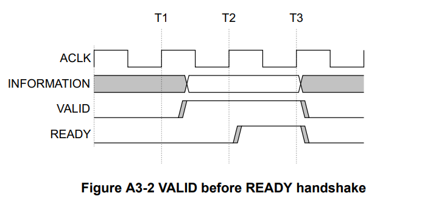
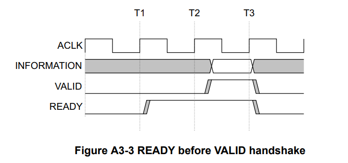

## TSIM

（待补充）

### 结构图

``` 
  
   ___________      ___________                       ___________
   |         |      |         |                       |         |
   | HostDPI | <--> | RegFile | <-------------------> |         |
   |_________|      |_________|                       |         |
                                                      |   MY    |
   ___________      ___________      ___________      |  CORE   |
   |         |      |         |      |         |      |         |
   | MemDPI  | <--> | DPI2AXI | <--> |   VME   | <--> |         |
   |_________|      |_________|      |_________|      |_________|
                                                      
  
```


## VTA Memory Engine

VME是VTA中的memory engine，提供了任意数量（可配置）的读写端口，是AXI总线接口的wrapper。加速器可以通过实现`VME_read_master`和`VME_write_master`分别对接VME的读口和写口。遗憾的是VME内部只实现了多个读写端口的仲裁功能，没有使用AXI burst。

#### Read Master

``` verilog
module VME_read_master #
(
    parameter ADDR_BITS = 32,
    parameter DATA_BITS = 64,
    parameter LEN_BITS 	= 8
)
(
    input                       clk_in,
    input                       reset_in,
    
    input                       req_cmd_ready_in,
    output                      req_cmd_valid_out,
    output [ADDR_BITS - 1 : 0] 	req_cmd_addr_out,
    output [LEN_BITS  - 1 : 0]	req_cmd_len_out,

    output                      resp_ready_out,
    input                       resp_valid_in,
    input  [DATA_BITS - 1 : 0]	resp_data_in
);
```

#### Write Master

``` verilog 
module VME_write_master #
(
    parameter ADDR_BITS = 32,
    parameter DATA_BITS = 64,
    parameter LEN_BITS 	= 8
)
(
    input                       clk_in,
    input                       reset_in,
    
    input                       req_cmd_ready_in,
    output                      req_cmd_valid_out,
    output [ADDR_BITS - 1 : 0]  req_cmd_addr_out,
    output [LEN_BITS  - 1 : 0]  req_cmd_len_out,

    input                       req_data_ready_in,
    output                      req_data_valid_out,
    output [DATA_BITS - 1 : 0]  req_data_out
    
    input                       resp_ack_in
);
```

### 读写端口规则

由于VME是AXI接口的wrapper，因此读写规则与AXI一致。

* 读口：通过`req_cmd_*_out`发起读请求，指定需要读取的数据地址和数据长度。在发送请求后，读口应拉高`resp_ready_out`等待数据从`resp_*_in`端口传入，需要读取`req_cmd_len_out`次数据

* 写口：通过`req_cmd_*_out`发起写请求，指定需要写入的数据地址和数据长度。在发送请求后，等待`req_data_ready_in`被拉高，通过`req_data_*_out`写入`req_cmd_len_out`次数据。另外，VME提供了`resp_ack_in`信号来提示写口，写请求已被全部接收。

握手规则统一采用`READY before VALID handshake`，在ready信号被拉高的后一个周期开始进行数据传输。





### 参数规则

`ADDR_BITS`，`DATA_BITS`，`LEN_BITS`都由总线参数决定，使用读写口时，`module`需要提供传入参数的接口（parameter）。

## Register File

### 接口代码

``` verilog
module rf_interface #
(
    parameter ECNT_NUM = ?,
    parameter VAL_NUM  = ?,
    parameter PTR_NUM  = ?,
    
    parameter REG_BITS = 32,
    parameter PTR_BITS = 32
)
(
    input                       launch,
    output                      finish,

    output [ECNT_NUM - 1 : 0]   ecnt0_valid_out,
    output [REG_BITS - 1 : 0]   ecnt0_data_out  [ECNT_NUM - 1 : 0],
    
    input  [REG_BITS - 1 : 0]   val_data_in     [VAL_NUM - 1 : 0],
    
    input  [PTR_BITS - 1 : 0]   ptr_data_in     [PTR_NUM - 1 : 0]
)
```

### 寄存器规则

RF提供了4种寄存器类型：

1. **控制寄存器**：用于管理加速器的运行状态，默认只提供了`launch`和`finish`两种状态。加速器无法直接访问该寄存器，只能通过RF接口提供的`launch_in`和`finish_out`进行交互。当`launch_in`被拉高时，加速器可以开始正常运行；当加速器任务执行完毕后，需要将`finish_out`信号拉高一个周期，并停止运行。

2. **性能计数器**：RF只提供了性能计数器的接口，需要加速器内部实现具体的性能计数器规范，主机可以通过RF提供的接口直接访问计数器（只读）。加速器可以通过`ecnt_data_out`和`ecnt_valid_out`接口提供计数器和有效位的值。

3. **变量寄存器**：用于管理可以直接使用的参数，如卷积运算的参数，数据格式的参数、运算阵列的大小配置信息等。加速器可以通过`val_data_in`进行访问。  

4. **指针寄存器**：用于管理地址参数，如访存的基地址等。加速器可以通过`ptr_data_in`进行访问。

主机访问上述四类寄存器是统一寻址的，地址从0x00开始，从低到高依次是，控制寄存器，性能计数器，变量寄存器，指针寄存器。加速器访问则是独立寻址，地址都从0x00开始。其中，加速器无法直接读取控制寄存器，变量寄存器和指针寄存器为只读，只有性能计数器完全由加速器所管理。

### 参数规则

`REG_BITS`和`PTR_BITS`分别表示变量寄存器（包括控制寄存器和性能计数器）和指针寄存器的大小，默认都是32，即每个寄存器大小为32 bit，每个相邻的寄存器地址相差0x04。

`ECNT_NUM`，`VAL_NUM`，`PTR_NUM`分别表示每一类寄存器的数量，取值由具体设计决定。